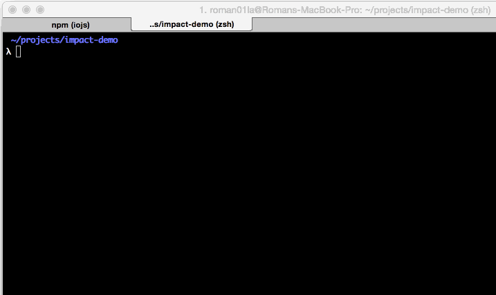

impact-node
===========

This package includes Node.js CLI for better development with ImpactJS.

## Installation

`npm install -g impact-node`

## Usage

### Create project

`impact-node create:project {path to impact dir}`

This will copy ImpactJS core into current directory and bootstrap a project, thus you can keep ImpactJS somewhere on your disk.

### Create entity

`impact-node create:entity {name}`

This will create a new entity file with basic setup.

***Why no command for creating level?***
*This is what Weltmeister should be used for.*

### Run development server

`impact-node serve`

This will run the server at [http://localhost:3000/](localhost:3000).

- Game view: [http://localhost:3000/](localhost:3000/)
- Weltmeister level editor: [http://localhost:3000/editor/](localhost:3000/editor/)

You can run server on different port.

`impact-node serve -p 9000`

And in watch mode. Game view will be updated when project's files changed.

`impact-node serve --watch`

### Build

`impact-node build`

This will compress code into a single file ready for production and put it into `build` including `media` dir with game assets.

## ToDo
- [ ] Tests
